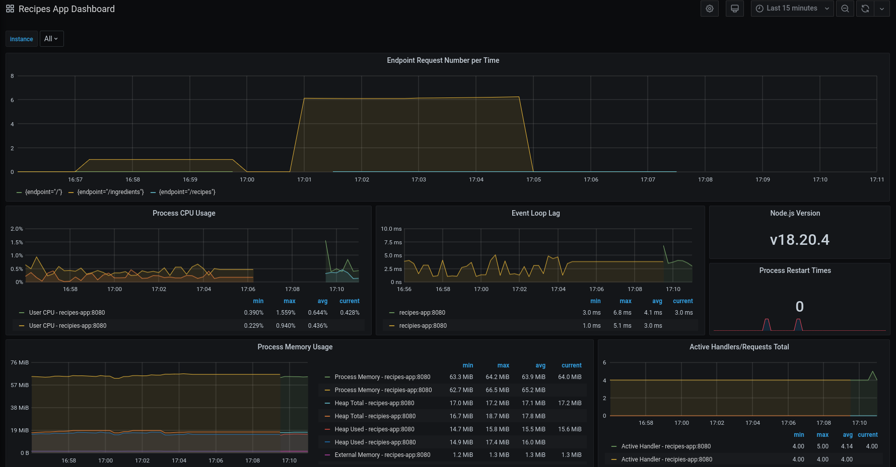
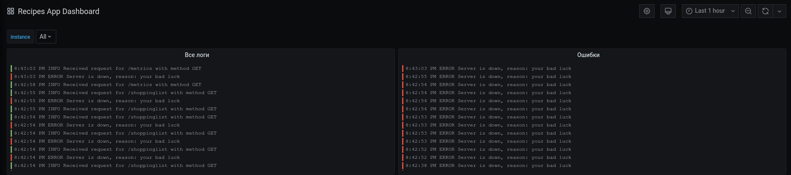

# Приложение для хранения кулинарных рецептов и планирования покупок

Сгенерировано на основе .yaml файла в папке api

# Запуск

> docker-compose up

- Сервер запустится на порту 8080
- Prometheus запустится на порту 8081
- Grafana запустится на порту 8082

# Метрики

Prometheus + Grafana
- стандартные метрики NodeJS приложений
- пользовательская метрика "Число запросов"
- панель создается автоматически

Пример панели:

# Логи

Loki + Promtail
- вывод всех логов
- вывод только логов уровня "ошибка" (имитируется с некоторой вероятностью при запросе на любой эндпоинт)

Пример панели:

